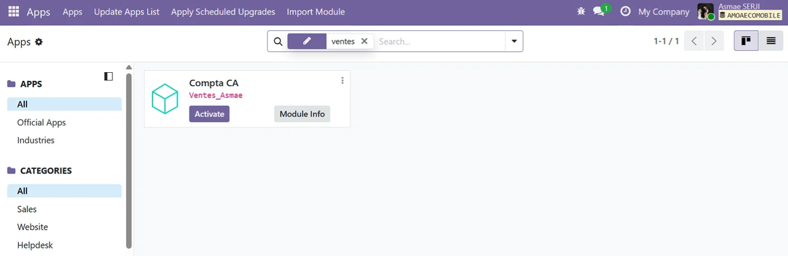
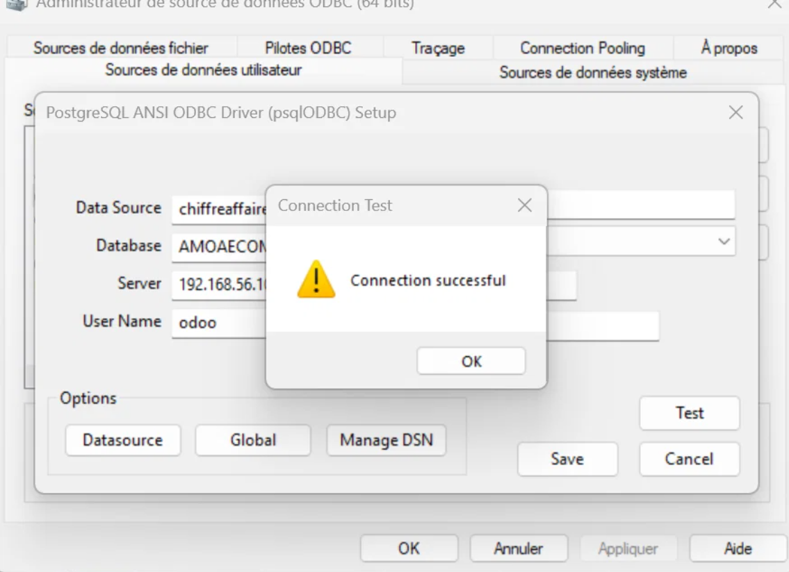

# Odoo 19 – Sales module with real‑time revenue (CA)

Custom Odoo 19 module for sales management. Features computed field for instant total revenue (CA), XML views (list/form), CSV security, and Power BI integration via ODBC. Deployed on Debian VM.

## 🧱 Tech stack
- Odoo 19
- PostgreSQL 15
- Power BI
- Debian 12 / WinSCP / PyCharm

## 📂 Project structure (arborescence)

## 🚀 Installation
1. Copy `code/ventes/` into `/usr/lib/python3/dist-packages/odoo/addons/`
2. Restart Odoo: `sudo systemctl restart odoo`
3. Activate "Compta CA" from Apps

## 📸 Screenshots

## 👤 Author
Asmae SERJI – Academic project supervised by Pr. Abdellah ZAOUIA
