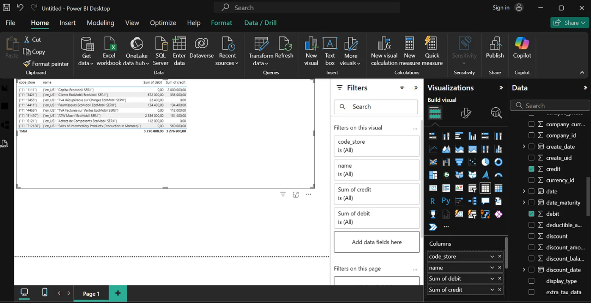

# Odoo 19 – Sales module with real‑time revenue (CA)

Custom Odoo 19 module for sales management. Features computed field for instant total revenue (CA), XML views (list/form), CSV security, and Power BI integration via ODBC. Deployed on Debian VM.

## 🧱 Tech stack
- Odoo 19
- PostgreSQL 15
- Power BI
- Debian 12 / WinSCP / PyCharm

## 📂 Project structure (arborescence)

odoo19-sales-ca-module/
├── README.md
├── docs/
│   ├── rapport.pdf
│   └── screenshots/
│       ├── odo_form.png
│       ├── odo_list.png
│       ├── powerbi_dashboard.png
│       ├── odbc_config.png
│       └── vm_status.png
└── code/
    └── ventes/
        ├── __manifest__.py
        ├── models.py
        ├── views.xml
        ├── __init__.py
        └── security/
            └── ir.model.access.csv

## 🚀 Installation
1. Copy `code/ventes/` into `/usr/lib/python3/dist-packages/odoo/addons/`
2. Restart Odoo: `sudo systemctl restart odoo`
3. Activate "Compta CA" from Apps

## 📸 Screenshots
Place your screenshots inside `docs/screenshots/` and link them:

## 👤 Author
Asmae SERJI – Academic project supervised by Pr. Abdellah ZAOUIA
